# Отчёт о проведённом тестировании

## 1. Краткое описание

Поставлена задача — автоматизировать позитивные и негативные сценарии покупки тура по определённой цене двумя способами (обычная оплата по дебетовой карте; выдача кредита по данным банковской карты).
Выполнена автоматизация тестирования веб-сервиса посредством UI- и Db-тестов.
По результатам проведения тестов выявлен ряд дефектов и составлены рекомендации по их устранению. 

## 2. Количество тест-кейсов

Всего 65 тест-кейсов.

**Позитивные UI-сценарии:**

1–2. Успешная покупка тура по дебетовой карте и в кредит (обе формы через параметризованные тесты): заполнение форм валидными данными, отправка, появление сообщения «Успешно  Операция одобрена Банком.». // 2 tests passed

3. Проверка Preview Page на соответствие исходным данным всех исходных картинок и текстов. Проверка проходит успешно. // 1 tests passed

**Негативные UI-сценарии:**

Отказ в покупке по дебетовой карте и в выдаче кредита (обе формы через параметризованные тесты) при заполнении форм невалидными данными:

4–5. Пустое значение НОМЕРА карты, появление сообщения «Поле обязательно для заполнения» // 2 tests failed

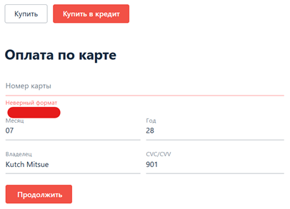
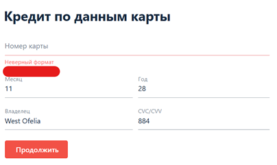

6–7. Заполнение НОМЕРА карты невалидными данными (CARDNUMBER-DECLINED по ТЗ), появление сообщения об отказе «Ошибка. Ошибка! Банк отказал в проведении операции.» // 2 tests failed

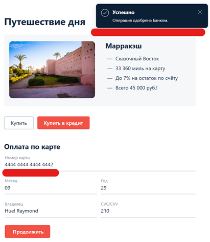
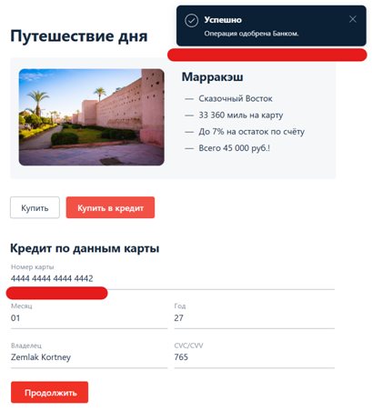

8–9. Невалидное рандомное значение НОМЕРА карты, появление сообщения об отказе «Ошибка. Ошибка! Банк отказал в проведении операции.» // 2 tests passed

10–11. Короткий НОМЕР карты, появление сообщения «Неверный формат» // 2 tests passed

12–13. Спецсимволы в НОМЕРЕ карты, поле ввода должно остаться пустым // 2 tests passed

14–15. Буквы в НОМЕРЕ карты, поле ввода должно остаться пустым // 2 tests passed

16–17. Пустое значение МЕСЯЦА, появление сообщения «Поле обязательно для заполнения» // 2 tests failed

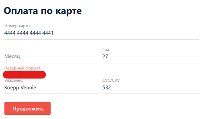
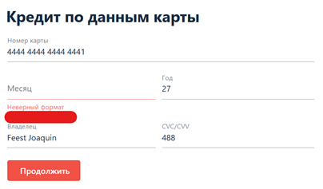

18–19. Короткое значение МЕСЯЦА, появление сообщения «Неверный формат» // 2 tests passed

20–21. Нулевой МЕСЯЦ, появление сообщения «Неверно указан срок действия карты» // 2 tests failed

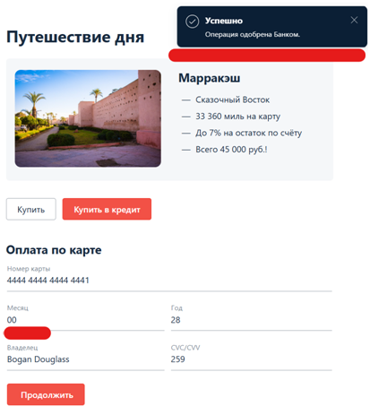
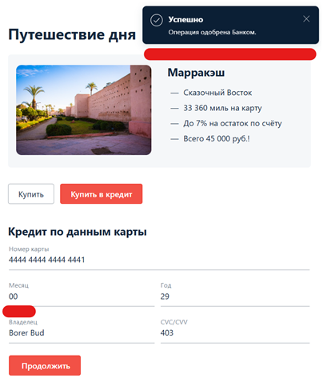

22–23. Тринадцатый МЕСЯЦ, появление сообщения «Неверно указан срок действия карты» // 2 tests passed

24–25. Прошлый МЕСЯЦ (текущий год), появление сообщения «Неверно указан срок действия карты» // 2 tests passed

26–27. Спецсимволы в МЕСЯЦЕ, поле ввода должно остаться пустым // 2 tests passed

28–29. Буквы в МЕСЯЦЕ, поле ввода должно остаться пустым // 2 tests passed

30–31. Пустое значение ГОДА, появление сообщения «Поле обязательно для заполнения» // 2 tests failed

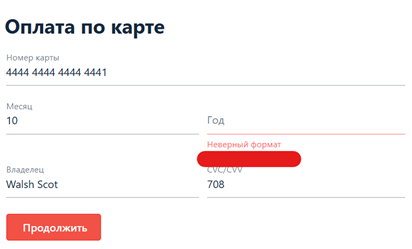
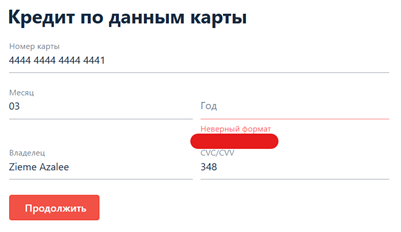

32–33. Короткое значение ГОДА, появление сообщения «Неверный формат» // 2 tests passed

34–35. Прошлый ГОД, появление сообщения «Истёк срок действия карты» // 2 tests passed

36–37. Указан ГОД более пяти лет вперёд, появление сообщения «Неверно указан срок действия карты» // 2 tests passed

38–39. Спецсимволы в поле ГОДА, field ввода должно остаться пустым // 2 tests passed

40–41. Буквы в поле ГОДА, поле ввода должно остаться пустым // 2 tests passed

42–43. Пустое значение ИМЕНИ, появление сообщения «Поле обязательно для заполнения» // 2 tests passed

44–45. ИМЯ на русском языке, появление сообщения «Неверный формат» // 2 tests failed

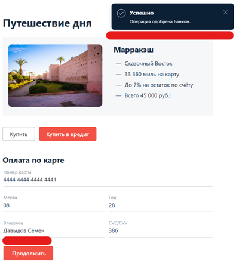
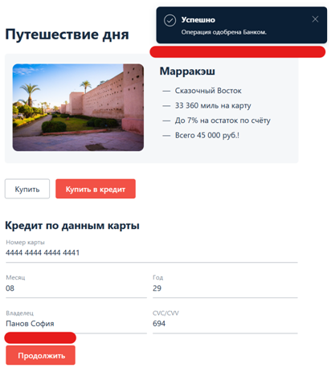

46–47. Спецсимволы в ИМЕНИ, поле ввода должно остаться пустым // 2 tests failed

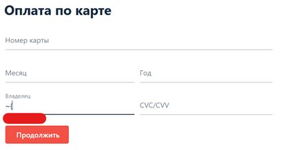
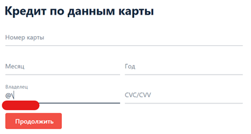

48–49. Цифры в ИМЕНИ, поле ввода должно остаться пустым // 2 tests failed

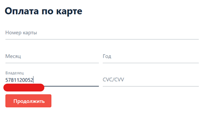
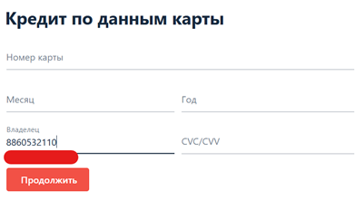

50–51. Пустое значение CVC, появление сообщения «Поле обязательно для заполнения» // 2 tests failed

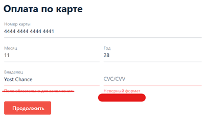
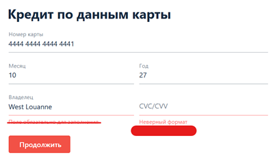

52–53. Двузначное число в CVC, появление сообщения «Неверный формат» // 2 tests passed

54–55. Спецсимволы в CVC, поле ввода должно остаться пустым // 2 tests passed

56–57. Буквы в CVC, поле ввода должно остаться пустым // 2 tests passed

**DB-tests:**

58–60. Запись в СУБД MySQL: проверка создания записей в таблицах. Соответствие статусов дебетовой и кредитной карт и способов оплаты. // 3 tests passed

61–63. Запись в СУБД PostgreSQL: проверка создания записей в таблицах. Соответствие статусов дебетовой и кредитной карт и способов оплаты. // 3 tests passed

64–65. Проверка отсутствия сохранения данных карт: валидация того, что номера карт и CVC-коды не попадают ни в одну из таблиц СУБД. // 2 tests passed

## 3. Процент успешных и неуспешных тест-кейсов

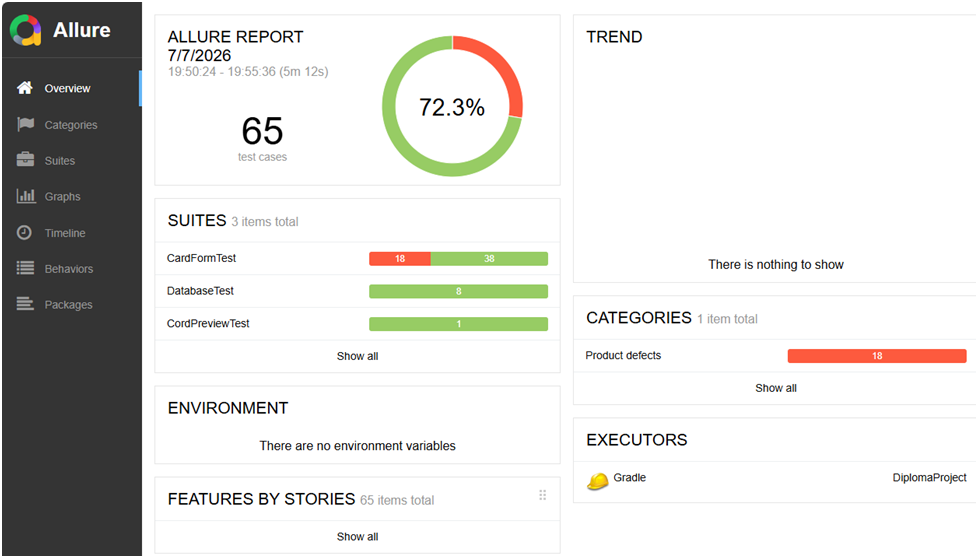

Из 65 проведённых тестов процент успешных составляет 72,3%.

27,7% неуспешных тестов — это критический показатель, который является сигналом о серьёзных проблемах с качеством продукта. Приложение находится в «сыром» состоянии, и интеграция с банковским симулятором полностью не налажена — продукт не готов к релизу.
В число неуспешных тестов входят:
- Blocker — 10 шт. (№№ 6, 7, 16, 17, 20, 21, 30, 31, 50, 51);
- Minor — 8 шт. (№№ 4, 5, 44, 45, 46, 47, 48, 49).

## 4. Общие рекомендации

**Добавление уникальных локаторов**

В текущей реализации веб-страницы полностью отсутствуют уникальные локаторы (такие как «id» или «data-test-id») для критически важных элементов интерфейса. Из-за этого при автоматизации UI-тестов пришлось использовать селекторы, привязанные к текстовому содержимому кнопок и маскам ввода. Любое незначительное изменение вёрстки, смена локализации или обновление дизайна приведёт к массовому падению автотестов. Рекомендую добавить в HTML-код элементов специализированные селекторы для автоматизации.

**Устранение Minor дефектов**

Для повышения качества UI и валидации форм рекомендую исправить поведение полей ввода, ставшее причиной падения 8 Minor тест-кейсов (№№ 4, 5, 44, 45, 46, 47, 48, 49) — обеспечить единообразие текстов подсказок под полями ввода («Неверный формат», «Поле обязательно для заполнения»), чтобы облегчить пользователю исправление ошибок при некорректном заполнении форм.

**Устранение Blocker дефектов**

Для стабильной функциональности приложения необходимо в первую очередь локализовать и устранить причины падения 10 Blocker тест-кейсов (№№ 6, 7, 16, 17, 20, 21, 30, 31, 50, 51), так как в данных случаях операции по картам проходят успешно при заполнении форм неверными данными или выводе некорректных уведомлений.

Текущий показатель успешных тестов составляет 72,3%, что не позволяет согласовать релиз. Выявленные 10 блокирующих дефектов (Blocker) полностью нарушают работу основного бизнес-сценария покупки тура. Продукт возвращён на доработку. Проведение повторного регрессионного тестирования планируется после устранения всех блокирующих уязвимостей.